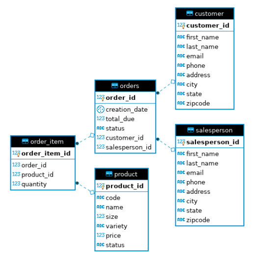

## Introduction 

This application aims to enlighten JDBC which is one of the most fundamental and frequent used Java libraries. JDBC allows a connection between a Java application and an RDBMS.User can connect with PostgresSQL and make amendments in the tables using CRUD operations (create, read, update, delete). This project also gives the idea Data Access Object, Data Transfer Object as an interface, and Database Transaction by using JDBC. 

## ER Diagram

##  Design Patterns
This section discusses the two famous design patterns that are as follows:
#### DAO (Data Access Object)
DAO provides abstraction on database/data files or any other persistence mechanism so that, persistence layer could be manipulated without knowing its implementation details. DAO involves more complex queries since there is involvement is multiple tables. We can say, DAO is an abstraction of data persistence.

#### Repository Pattern
This pattern does't involve complex quesries, rather it foccus to use simple ones.  Here, unloke DAO, repository pattern works typically on single table or DTO by acting as an abstraction betweeen various colletion of objects.
