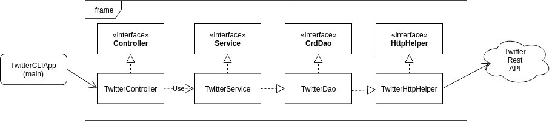

## Introduction 

This Java application is a twitter based application that can post, show and delete the tweet using REST APIs unlike traditional usage through mobile or web application. I learned how to use a Java library to process JSON documents, deeper knowledge of DTOs, DAO design pattern and maven project structure dependencies. This project is based on MVC architecture (Model, view and Controller).

While implementing Twitter CLI, I also implemented basic spring framework.
## Design



1) TwitterHttpHelper : HttpHelper builds connection between Twitter API and Java application. It executes HTTP with given URI and authorizes the HTTP request. 
2) TwitterDAO : TwitterDAO is used to construct  URIs from the tweet object and invokes Twitter HTTP Helper. It implements three methods create, findById and deleteById
3) TwitterService : TwitterService is used to handle the business logic of the application, it validates the text length, tweet coordinate and ID format, then return Twitter Object.
4) TwitterController : TwitterController validates the user input from CLI and invokes the methods implemented TwitterService method. It validate user input and then successively parse argument.
5) TwitterCLIApp : TwitterCLIApp is used to take inputs from the command line and invoke methods imlpemented in TwitterController.

## Quick Start

  * First set up the environment variables for OAuth and package the project through Maven. 
  * To build the project, run `maven package` in command line window inside the twitter directory that will download all the dependencies from `pom.xml`.
  * Lastly, to run the app, `java -jar target/java_apps-1.0-SNAPSHOT.jar post|show|delete [option(s)]` in the command window as shown below.
 
 #### Usage
 
* Post a Tweet
`twitterCLIApp post "sample text" "Longitude:Latitude"`

* Show a Tweet
`twitterCLIApp show "id"`

* Delete a Tweet
`twitterCLIApp delete "tweetId1,tweetId2,tweetId3..." `
 
## Model

Models are implemented with POJOs which is a class with private member variables and public getter and setters. This class encapsulates Tweet data (Tweet Objects) which often display in JSON format as shown below: 
```{
  "created_at" : "Thu Nov 28 20:11:33 +0000 2019",
  "id_str" : "1200145224103841792",
  "text" : "test post",
  "entities" : {
    "hashtags" : [ ],
    "user_mentions" : [ ]
  },
  "coordinates":null,  
  "retweet_count" : 0,
  "favorite_count" : 0,
  "favorited" : false,
  "retweeted" : false
	} 
```
Tweet model contains the following properties that are required in posting, showing or deleting the data consumed from our Twitter App.
However, if we look upon the real tweet model which is used by Twitter API, is really complex consisting alot many field and properties. 

## Improvements 
1. In our application, we are particularly just trying to get the tweet by id. However, we can extend the functionality by getting the information/tweet by other parameters as it will let user to be flexible in retrieving the tweets in much broader way.
2.  Adding more options/properties in the tweet object like friend_count, contributers_enables will allow user to use more functionalities of this application.
3. Different media except text can be posted to extend the application.


