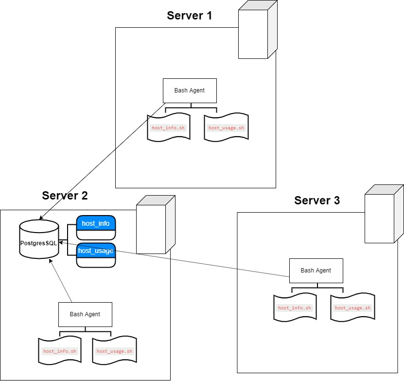

## Introduction 

The Linux Cluster Administration (LCA) team manages a Linux cluster of 10 nodes/servers which are running CentOS 7. These servers are internally connected through a switch and able to communicate through internal IPv4 addresses.

The LCA team needs to record the hardware specifications of each node and monitor node resource usages (e.g. CPU/Memory) in realtime (see appendix A). The collected data should be stored in an RDBMS database. LCA team will use the data to generate some reports for future resource planning purposes (e.g. add/remove servers).

## Architecture Diagram & Design


### Linux_sql project structure and Design
1. Scripts
    * host_info.sh: collects the host hardware info and insert it into the database. It will be run only once at the installation time.
        `host_info.sh psql_host psql_port db_name psql_user psql_password`

    * host_usage.sh collects the current host usage (CPU and Memory) and then insert into the database. It will be triggered by the crontab job every minute.
        `host_usage.sh psql_host psql_port db_name psql_user psql_password`

    * psql_docker.sh: This script creates jrvs-psql container, provides pgdata volume where postgres database will be stored.
        `psql_docker.sh start|stop [db_password]`
2. SQL
    * ddl.sql : It is a SQL file used to create the host_agent database. The file then populates the database with tables for host machine specifications and usage data. 
    
    * queries.sql : contains queries to manipulate data
 
3. Readme.md: contains the high level description of project architecture
## Usage
1. Executing DDL script which creates database and two tables
        ```bash
        psql -h localhost -U postgres -W -f ./linux_sql/sql/ddl.sql
        ```
        
2. Execute `host_info.sh` to save the host related information with argument as mentioned below:
        ```bash
        ./scripts/host_info.sh psql_host psql_port db_name psql_user psql_password
        ```
        
3. `host_usage.sh` usage
        ```bash
        ./scripts/usage.sh psql_host psql_port db_name psql_user psql_password
        ```
        
4. crontab setup:
        run `crontab -e`. Then add
    ```bash
         * * * * * bash ~/linux_sql/scripts/host_usage.sh "localhost" 5432 "host_agent" "postgres" "postgres" > /tmp/host_usage.log
         
save and exit.
## Improvements 
1. Handle hardware update
2. Instead of typing localhost, password, username and port, we can set env. variables.
3. We can psql instance at the start of VM instance


